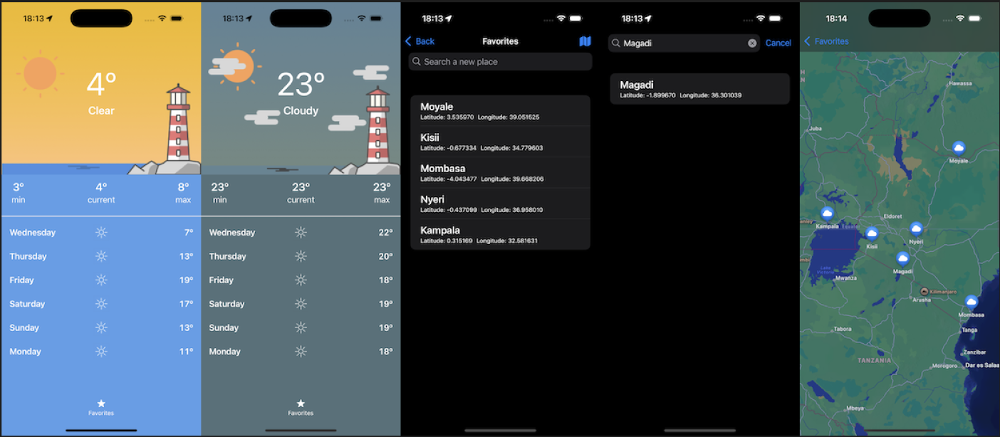

# Atmos Weather app in Swift



## Setup and Run

Copy and paste code from `develop.xcconfig.example` to a new `develop.xcconfig` file and add in the Weather API Key as needed.

Alternatively, while on the project directory on the terminal, you may run this command and paste the Weather API Key from openweather api

```bash
cat develop.xcconfig.example > develop.xcconfig
```

Build the project using `cmd+B` (⌘B)
Select the run destination. Run the project using `cmd+R` (⌘R)

## Third-party Libraries

All third party libraries are implemented in Swift Package Manager (SPM). Opening the project in Xcode will automatically resolve package dependencies. In case of failure, on Xcode go to `File > Packages > Resolve Package Versions` or via the command line using `xcodebuild -resolvePackageDependencies`

Apple's Swift Log `https://github.com/apple/swift-log` providing simple easy to use logging APIs.

## Conventions

#### Architecture

Model View ViewModel (MVVM) with implementations being done in SwiftUI

#### Localizations

Baked into the current app version is Localization using `Localizable.xcstrings` for English, French and Afrikaans. _*A disclaimer is that the translations were retrieved from Google Translate and may vary slightly in meaning based on the context and/or gender for French*_

#### CoreLocation

The app is limited to only fetch weather and apply it over a 5 km radius.

#### Code Coverage

At the time of submission of this project, code coverage sat at 52% coverage.

## Performing Tests

##### Running Tests in Xcode

1. Open your project in Xcode.
2. Use shortcut cmd+U (⌘U) to run all tests

##### Running Tests in Command Line

Tests can also be run from the command line using the `xcodebuild` command. Make sure your terminal is in the project directory before running the command.

```bash
xcodebuild -scheme develop -destination 'platform=iOS Simulator, name=iPhone14' test
```

##### Static code analysis

Static code analysis is done using [Swiftlint](https://github.com/realm/SwiftLint) based off Github Swift Style Guide

```bash
swiftlint lint
swiftlint analyze
swiftlint --fix
```

## CI/CD

##### CircleCI

Initial implementation for CircleCI Pipelines.

##### Xcode Cloud

For ease of integration, Xcode Cloud provides build validation and CI/CD including appstore review submission although it requires additional setup on Appstore Connect. It provides a simple and 'free' means of deployment.

## Improvements

These are improvements I would make if I had more time to improve the project.

1. Clean up Models around Location and CoreLocation
2. Improve visual error handling
3. Offline capability and Caching
4. Improve the UI to make it more intuitive and support better accessibility
5. Improve code coverage to a minimum 80%
6. Add support for `Fastlane` as an alternative to xcodeCloud, in a case where working with multiple teammates with varied access levels to appstoreconnect.
